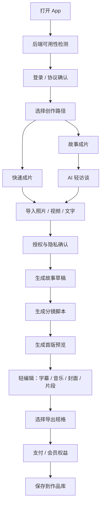
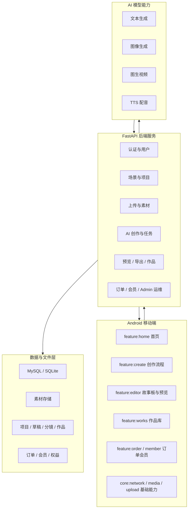
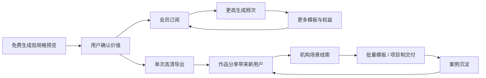
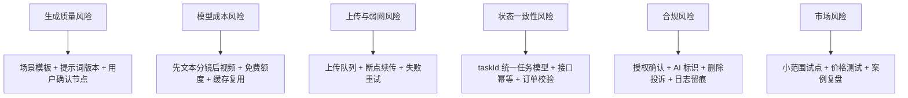

# 忆像成章——多模态人生故事影像创作平台项目计划书

> 本计划书依据当前仓库代码、产品文档和公开政策资料整理。仓库工程名与 App 原型名仍以“映人生”为主；在竞赛、申报或路演材料中，建议使用“忆像成章——多模态人生故事影像创作平台”作为项目正式名称，将“映人生”作为 Android App 产品原型名称。  
> 当前项目主入口是 Android 移动端，后端为 FastAPI 服务，承担账号、项目、素材、AI 生成、任务状态、作品、订单、会员和内部运维支撑。仓库中没有面向客户销售的完整 Web 平台，`/admin` 页面应表述为内部运维能力。

---

## 项目摘要

“忆像成章”想解决的是一个很日常、也很真实的问题：人们拍了越来越多照片和视频，却很少真正把它们整理成一支能反复观看、能送给亲友、能留下人生节点的短片。旅行结束后，相册里有几百张照片；孩子生日、毕业、婚礼、父母纪念日之后，素材躺在手机里；很多人并不是没有表达欲，而是卡在“不会写故事、不会剪辑、不会配旁白、不会做节奏”这些具体门槛上。

本项目以 Android App 为用户入口，用后端 AI 服务把照片、视频、录音、文字等多模态素材整理成故事草稿、分镜脚本、旁白字幕、首版预览和最终导出作品。它不是一个功能堆满的专业剪辑软件，也不是只会生成一段文案的聊天工具，而是围绕“素材采集、AI 访谈、叙事生成、分镜编排、成片预览、轻量编辑、导出付费、作品沉淀”构建一条完整的创作链路。

当前仓库已经具备开发版基础：Android 侧采用 Kotlin、Jetpack Compose、Material 3 和多模块结构，包含首页、创作、素材导入、AI 访谈、故事草稿、分镜、预览、导出、会员、订单、作品、个人中心、机构入口等页面骨架；后端采用 FastAPI、Pydantic、SQLAlchemy，支持 MySQL 与 SQLite，已实现认证、用户、场景、项目、上传、素材、AI 创作、任务、导出、作品、订单、会员等接口，并预留 DashScope 文本、图像、视频和 TTS 模型配置。在没有模型 Key 的情况下，文本链路可返回本地演示结果，保证主流程可联调。

项目的商业化不依赖单次买断，而是采用“免费预览、高清导出付费、会员订阅、增值包、机构合作”的组合模式。C 端面向家庭影像、旅行纪念、毕业祝福、人生回忆等场景；B 端可延伸至文旅景区、学校、婚庆、摄影工作室、养老机构等批量影像服务场景。项目后续最重要的任务，是补齐真实用户测试、支付和对象存储、生成质量评测、合规材料、软著/商标/专利、试点案例和财务测算依据。

---

## 第一章 项目背景

### 1.1 政策背景：AI 应用、数字文化与合规治理正在同时加速

“忆像成章”所处的位置，正好落在三条政策线的交汇处：一是人工智能从技术突破走向规模化应用，二是数字文化内容生产加速升级，三是生成式 AI、深度合成和个人信息保护进入更具体的治理阶段。对一个 AI 影像创作平台来说，这意味着机会和约束是同时出现的：政策鼓励 AI 进入真实场景、赋能内容生产，但也要求平台对肖像、隐私、版权、生成标识和未成年人保护承担更清晰的责任。

| 政策文件 | 关键方向 | 与本项目关系 |
|---|---|---|
| [国务院关于深入实施“人工智能+”行动的意见](https://www.gov.cn/zhengce/zhengceku/202508/content_7037862.htm) | 推动人工智能与经济社会各领域广泛深度融合，发展智能经济和智能社会 | 本项目属于“人工智能+数字内容创作”的具体应用，目标不是展示模型能力，而是把 AI 放进可付费、可交付的移动创作流程 |
| [国务院关于印发“十四五”数字经济发展规划的通知](https://www.gov.cn/zhengce/zhengceku/2022-01/12/content_5667817.htm) | 以数据为关键要素，推动数字技术与实体经济深度融合，扩大文化、旅游、教育等领域数字化供给 | 项目将用户素材、创作项目、AI 生成结果和作品资产结构化沉淀，服务数字内容供给 |
| [中共中央办公厅、国务院办公厅印发《“十四五”文化发展规划》](https://www.mct.gov.cn/preview/special/wlscfwzlts/zcwj/202306/t20230605_944224.htm) | 推动文化产业数字化布局，鼓励运用大数据、5G、云计算、人工智能、超高清等技术重塑文化发展模式 | 项目用 AI 影像生成服务家庭记忆、校园纪念、文旅故事和群众文化表达 |
| [国务院关于印发新一代人工智能发展规划的通知](https://www.gov.cn/zhengce/content/2017-07/20/content_5211996.htm) | 强调人工智能跨界融合、人机协同和产业智能化升级 | 项目以人机协同方式完成素材整理、故事生成和影像创作 |
| [生成式人工智能服务管理暂行办法](https://www.cac.gov.cn/2023-07/13/c_1690898327029107.htm) | 明确生成式 AI 服务提供者在内容安全、个人信息保护、投诉举报等方面的责任 | 项目需要建立用户协议、隐私保护、生成内容审核和投诉处理机制 |
| [互联网信息服务深度合成管理规定](https://www.cac.gov.cn/2022-12/11/c_1672221949354811.htm) | 对人脸、人声、图像、视频等深度合成服务提出管理要求 | 项目涉及照片、人声、视频生成和可能的人脸形象处理，需要强化授权和标识 |
| [人工智能生成合成内容标识办法](https://www.cac.gov.cn/2025-03/14/c_1743654685899683.htm) | 要求生成合成内容添加显式或隐式标识，自 2025 年 9 月 1 日起施行 | 项目导出视频、封面、旁白和 AI 生成片段时，应设计 AI 标识和文件元数据留痕 |
| [中华人民共和国个人信息保护法](https://www.samr.gov.cn/wljys/gzzd/art/2023/art_3ef1e889c1e644d4b65b5f5c7f432386.html) | 对个人信息、敏感个人信息和未成年人信息处理提出要求 | 用户照片、人脸、录音、儿童影像都可能构成敏感信息，必须遵循必要性、告知同意和严格保护原则 |

因此，本项目不能只把自己定义为“会生成视频的 App”。更准确的定位是：在政策鼓励 AI 应用落地和数字文化创新的背景下，建设一个兼顾创作效率、情感表达、数据安全和内容合规的多模态人生影像创作平台。

### 1.2 市场与用户痛点

过去几年，影像表达已经成为普通人的日常语言。朋友圈、家族群、短视频平台、毕业季活动、婚礼现场、文旅宣传、养老机构服务，都在不断制造新的影像需求。问题在于，大多数人拥有素材，却没有把素材变成故事的能力。

轻度记录者的痛点最明显。他们拍了很多，却几乎不剪；他们想要的是一支能分享的旅行片、生日片、节庆祝福片，而不是一套专业剪辑课。情感表达者则更在意片子是否“像是专门做过”，旁白是否动人，封面、音乐、字幕是否统一。家庭资料整理者手里常常有旧照片、录音、聊天截图和零散时间点，他们需要的是时间线梳理和人生节点提炼。机构客户则关注效率和规模：学校想批量生成毕业纪念，文旅景区想把游客素材变成传播内容，婚庆和摄影工作室希望提高交付效率。

现有工具各有能力，但都没有完全解决这个问题。专业剪辑软件强在自由度，却把创作压力留给用户；模板工具速度快，却容易同质化，难以承载家庭和人生故事；通用 AI 工具可以写文案、画图、生成视频片段，却缺少移动端素材采集、AI 访谈、故事确认、分镜、预览、支付和作品库的闭环。用户最后仍然要在几个软件之间搬运素材，创作成本并没有真正消失。

### 1.3 项目缘起

“忆像成章”的研发初衷，是把影像创作中最难的部分交给 AI 和后端系统，把最需要人判断的部分留给用户。用户不需要从时间线开始，也不需要先写完整脚本，只要回答几个和情绪、对象、场景有关的问题，上传照片、视频、录音或文字，系统就能先给出一版故事和预览。用户看到结果后，再决定是否替换镜头、调整旁白、改变音乐或导出成片。

这也是项目坚持 Android 移动端作为主入口的原因。人生影像素材主要产生在手机里，创作灵感也往往发生在移动场景；如果第一步就要求用户把素材导到电脑、打开复杂工具，很多真实需求会在开始前流失。Android App 负责“把用户带进来”，后端服务负责“把重活接过去”，二者组合才能形成稳定的创作体验。

---

## 第二章 产品介绍

### 2.1 产品定位

“忆像成章”是一套以 Android 移动端为入口、以后端 AI 生成服务为中枢的人生故事影像创作平台。它服务的不是专业剪辑师，而是普通家庭用户、校园用户、内容创作者和有批量交付需求的机构客户。产品的核心承诺可以概括为一句话：

**帮用户把照片、视频、录音和几句心里话，整理成一支有故事、有情绪、能导出分享的人生短片。**

当前仓库已经搭出这条链路的主要骨架。Android 端负责登录、协议确认、首页、创作入口、场景选择、素材导入、AI 访谈、风格选择、故事草稿、分镜、预览、导出方案、支付确认、作品、订单、会员和个人中心。后端负责认证、用户、场景、项目、上传、素材、AI 生成、任务、预览、导出、作品、订单、会员和内部运维。数据层沉淀项目、素材、草稿、分镜、作品、订单和会员权益；AI 层通过 DashScope 等模型能力支撑文本、图像、视频和 TTS 扩展。

### 2.2 产品形态与核心流程

项目采用“双路径创作”：一条是快速成片，一条是故事成片。快速成片适合旅行、节庆、生日、祝福等短周期、高频场景，用户少填信息，平台优先给出 30 到 60 秒的预览。故事成片适合人生回忆、家庭纪念、婚礼周年、毕业、退休、追思等场景，平台会通过 AI 访谈提取人物关系、时间线、情绪节点和表达目的，再生成更完整的叙事结构。

在用户体验上，产品避免把用户推向复杂时间线，而是采用“先出结果，再让用户微调”的方式。用户先看到一版能播放、能理解的作品，再做少量高价值调整：替换一段素材、重写一句旁白、换一首音乐、重新生成封面或压缩重复镜头。这种方式既适合普通用户，也便于控制 MVP 范围。

### 2.3 功能模块

首页不是简单的按钮集合，而是创作起点。它展示继续创作、快速开始、热门场景、推荐模板、最近作品、会员权益和机构合作入口，让用户知道自己现在可以做什么。

创作模块是产品的核心。用户选择旅行纪念、人生回忆、节庆祝福、主角故事、家庭相册整理等场景后，进入素材导入和 AI 访谈。素材导入支持照片、视频、录音、文字备注和截图等多模态输入；AI 访谈通过几个轻问题理解“这支片子是给谁的”“最想保留哪个瞬间”“希望温暖、热烈还是庄重”“是否需要 AI 配音或本人旁白”。

编辑模块不追求专业轨道能力，而是围绕故事板和预览展开。系统将内容拆成开场、铺垫、高光、收束等段落，每段展示匹配素材、旁白文本、字幕摘要和时长。用户可以调整段落顺序、重写局部文案、替换某段素材、调整情绪风格或重新生成某一段。

商业模块包括导出方案、订单、支付确认和会员中心。当前仓库后端已有单次高清导出价格雏形和 Lite、Pro、Max 会员套餐种子数据。作品模块负责管理草稿中、生成中、已完成、已分享的作品，最终形成用户自己的“人生影像库”。

机构合作模块目前是预留能力，适合未来扩展到文旅、学校、婚庆、摄影、养老机构等场景。机构端不应在早期过度开发，但可以通过 Android 入口和后端任务体系逐步延展批量上传、批量生成、模板管理、授权记录和批量导出能力。

### 2.4 技术架构

从仓库结构看，项目已经按前后端分离方式推进。Android 工程采用 Kotlin、Jetpack Compose、Material 3、Single Activity 和多模块组织方式，模块包括 `app`、`core`、`data`、`feature`、`sync`、`benchmark` 等。后端采用 FastAPI、Pydantic、SQLAlchemy，支持 MySQL 与 SQLite，并通过环境变量配置 DashScope 文本、图像、视频、TTS 模型。

这套架构的关键点，是 Android 端不承担重型 AI 生成和最终渲染。移动端负责采集、引导、展示和轻编辑；后端负责素材管理、任务编排、模型调用、数据持久化、导出和商业化记录。这样可以减少设备兼容压力，也便于后续接入对象存储、队列、监控、支付和内容审核。

### 2.5 创新点

本项目的创新点不在于“调用了某个大模型”，而在于把 AI 能力放进了人生影像创作这个具体流程里。第一，产品从用户的表达意图出发，而不是从素材参数出发；用户先说想表达什么，再上传素材。第二，AI 轻访谈把模糊情绪变成可生成的上下文，减少用户写提示词的压力。第三，平台采用故事草稿、分镜脚本、首版预览的分层生成方式，让用户逐步确认，也避免一开始就调用高成本视频模型。第四，授权记录、AI 标识和日志留痕被设计为流程的一部分，适应当前 AI 影像创作的合规要求。

### 2.6 知识产权规划

项目已具备“忆像成章”Logo 资产，包含横版主 Logo 和图形版标识。后续知识产权规划应围绕四类资产展开：一是 Android App 和后端服务的软件著作权；二是“忆像成章”“映人生”等品牌名称与图形商标；三是多模态素材到人生故事影像生成流程、AI 访谈式创作方法、生成内容标识与授权留痕方法等专利方向；四是场景模板、提示词、分镜结构、示例作品和视觉素材的版权管理。

---

## 第三章 产品优势

### 3.1 移动端入口更贴近真实创作场景

人生影像素材大多就在手机里。用户拍照、录视频、保存语音、记录文字、分享作品，几乎都发生在移动端。项目选择 Android App 作为入口，不是形式上的技术选择，而是对用户行为的顺势而为。相比让用户打开复杂桌面软件，移动端更适合完成素材采集、创作引导、首版预览和导出支付。

仓库中的 Android 多模块结构，也为后续迭代留出了空间。首页、创作、编辑、作品、订单、会员、个人中心、机构入口分别由不同 feature 模块承载，避免所有功能挤在一个单体页面中。对参赛或产品展示而言，这种结构比单页 Demo 更能说明项目具备继续工程化的基础。

### 3.2 AI 叙事能力提升内容厚度

模板工具能让片子“看起来完整”，但不一定让故事“讲得明白”。“忆像成章”的重点是把素材组织成叙事。用户上传的不是文件，而是某段关系、某次旅行、某个成长节点或某个纪念日。AI 需要理解这些素材背后的表达目标，再输出标题、旁白、字幕、镜头顺序和情绪节奏。

这种能力尤其适合人生回忆、家庭纪念、校园毕业、文旅故事等场景。它们不是单纯追求视觉刺激，而是需要开场、铺垫、高光和收束。项目通过 AI 访谈和分层生成，将这种叙事能力产品化。

### 3.3 后端任务体系让生成流程可控

AI 视频生成和最终导出是长耗时任务，如果直接让 Android 发起同步请求，体验会很脆弱。当前后端接口契约采用统一任务模型，通过 `taskId`、`status`、`progress`、`currentStage` 等字段管理生成、预览和导出状态。用户可以离开页面后再回来查看进度，系统也可以在失败时重试或给出 fallback。

这套任务体系还为商业化打下基础。导出是否成功、订单是否支付、会员权益是否扣减、作品是否生成，都需要可追溯的状态链。项目从早期就把项目、任务、订单、作品和会员纳入数据结构，比单纯生成结果更接近真实产品。

### 3.4 商业闭环清晰

项目商业化路径自然，不需要强行植入广告。用户先免费看到预览，如果觉得值得保存，再为高清无水印导出付费；高频用户转向会员；对质量要求更高的用户购买高级配音、4K、加急渲染或人工精修；机构客户则通过模板定制、批量生成和项目交付付费。

### 3.5 合规能力可成为信任壁垒

人生影像不是普通素材，它常常包含家人、儿童、老人、人脸、声音和私密生活场景。项目如果只追求生成速度，很容易陷入信任风险。相反，把授权确认、未成年人提示、AI 生成标识、删除机制、投诉入口和日志留痕做扎实，反而会成为平台进入家庭、校园、养老和机构场景的基础。

---

## 第四章 团队协作与核心竞争力

当前仓库未提供团队成员实名信息，本章先按项目实际需要描述组织结构，后续应替换为真实姓名、专业、职责、获奖和项目经历。

一个能把“忆像成章”做成的团队，不能只有算法或只有客户端。项目需要产品负责人把握场景和商业边界，需要 Android 研发保障移动端体验，需要后端研发承接任务、数据和模型调用，需要 AI 工程人员优化提示词和生成质量，需要设计人员把影像类产品做得温暖可信，也需要测试、运维、运营和合规支持。

| 角色 | 核心职责 | 当前仓库对应 |
|---|---|---|
| 项目负责人 / 产品经理 | 定义用户场景、版本边界、商业路径和路演材料 | 产品计划书、App 设计文档 |
| Android 研发 | Kotlin、Compose、多模块、素材导入、创作流程、预览展示 | `app`、`feature`、`core`、`data` |
| 后端研发 | FastAPI、数据库、接口、任务、订单、会员、内部 Admin | `server/app` |
| AI 工程 | DashScope 接入、提示词、故事草稿、分镜、预览生成 | `ai_provider`、`dashscope_text_client`、生成服务 |
| UI / UX 设计 | 首页、创作流程、故事板、会员、作品库、品牌视觉 | App 设计文档与品牌资产 |
| 测试与运维 | 接口测试、真机适配、部署、日志、监控、告警 | 待补充 |
| 商业运营 | 用户访谈、校园试点、机构合作、案例沉淀 | 待补充 |
| 合规与知识产权 | 隐私协议、肖像授权、AI 标识、软著、商标、专利 | 待补充 |

团队协作的关键，不是同时铺开所有功能，而是持续围绕一条主线迭代：用户能否从手机素材出发，在几分钟内看到一版值得保存的片子。每个迭代都应交付一个可演示闭环，例如“旅行纪念片从素材导入到首版预览”“人生回忆片从 AI 访谈到分镜确认”“导出付费到作品库沉淀”。这样既能降低研发失控风险，也能持续积累路演和用户验证材料。

从当前仓库进展看，项目已经完成概念设计、移动端基础页面、后端主接口、AI 接入配置、会员订单雏形和品牌资产建设，处于开发版原型和主链路联调阶段。下一阶段应把“能演示”推进到“能验证”：补真实模型输出样例、补截图和演示视频、补真机测试、补用户试用反馈，并在一个小场景里验证付费意愿。

---

## 第五章 个人成长

这个项目的训练价值不只在写代码。它要求团队从“我会做一个功能”走向“我能把一个真实需求拆成产品、技术、商业和合规四条线”。在立德树人层面，团队需要理解 AI 影像创作的边界：照片、人脸、声音和家庭影像不是普通数据，不能为了演示效果忽视用户授权和隐私保护。技术向善在这里不是口号，而是上传前的授权提示、导出时的 AI 标识、删除入口和投诉处理。

在行业理解层面，项目帮助团队看见生成式 AI 的真实落地点。模型本身很重要，但用户不会为“调用了某个模型”付费，用户愿意为“我终于得到一支可以发给家人的片子”付费。这个差异会倒逼团队学习产品定位、MVP 控制、模型成本、支付转化、客户访谈和机构交付。

在综合素质层面，项目覆盖 Kotlin、Compose、FastAPI、SQLAlchemy、API 契约、AI 接入、品牌设计、商业计划、财务测算和合规材料。无论后续用于竞赛、毕业设计、创业孵化还是课程实践，它都能作为一个完整的软件工程与人工智能应用案例。

---

## 第六章 风险分析与应对体系

### 6.1 外部风险

项目面临的第一类风险是合规风险。生成式 AI、深度合成和个人信息保护已经有明确规则，尤其是涉及人脸、人声、未成年人和视频生成时，平台不能只做技术效果展示，还必须处理授权、标识、投诉、删除和日志保存。

第二类风险是竞争风险。剪辑平台、大模型平台和短视频工具都可能推出类似功能。如果项目只停留在“调用模型生成视频”，很容易被大厂功能覆盖。项目需要把壁垒放在细分场景、移动端流程、人生叙事模板、机构交付经验和合规可信度上。

第三类风险是市场风险。用户喜欢 AI 生成效果，不代表愿意付费；机构愿意试点，不代表能规模采购。必须通过真实试用、访谈、价格测试和案例交付来修正商业假设。

### 6.2 内部风险

项目内部最大的风险，是主链路不稳。视频生成耗时长、模型输出不确定、上传文件大、移动网络波动、支付和导出状态复杂，如果没有任务队列、状态恢复、失败重试和幂等设计，用户体验会很快崩掉。

第二个风险是生成质量。人生影像对情绪和表达很敏感，旁白太空、字幕太硬、分镜不贴素材，用户会立刻觉得“不像我的故事”。这要求团队持续积累场景模板、提示词版本、人工编辑节点和效果评测集。

第三个风险是范围膨胀。项目很容易从“AI 影像创作”扩散到社交、模板市场、机构后台、积分商城、重型时间线和私有化部署。早期如果同时做太多，会牺牲最重要的首版成片体验。

### 6.3 应对体系

具体到研发计划，V1 应优先保证三件事：第一，创作主流程稳定跑通；第二，生成结果可以被用户局部修改；第三，导出、订单、会员和作品状态可追溯。机构批量、模板市场、积分商城、复杂经营看板可以后置，不应抢占早期资源。

---

## 第七章 商业计划与财务预测

### 7.1 商业模式

项目适合采用“免费预览 + 导出付费 + 会员订阅 + 增值服务 + 机构合作”的组合模式。免费预览解决用户试用门槛，单次导出解决低频用户的即时需求，会员订阅服务高频用户，增值服务提升客单价，机构合作打开项目制收入。

当前仓库后端已有单次高清导出 `¥39.90` 的产品雏形，也已有 Lite、Pro、Max 三档会员种子数据，月价分别为 `¥49`、`¥149`、`¥469`。这些价格可以作为计划书测算基础，但正式定价仍需通过真实用户测试修正。

| 产品 | 定价假设 | 目标用户 | 价值 |
|---|---:|---|---|
| 单次高清导出 | ¥39.90/次 | 低频家庭用户、旅行用户 | 无水印保存和分享 |
| Lite 会员 | ¥49/月 | 轻度创作者 | 基础生成额度、更多模板、去水印 |
| Pro 会员 | ¥149/月 | 高频个人创作者 | 更多额度、更快生成、高级配音和高清导出 |
| Max 会员 | ¥469/月 | 小团队或重度用户 | 批量能力、更长时长、优先资源 |
| 人工精修 | ¥199-1999/单 | 婚礼、追思、周年、纪念片用户 | 人工润色、精修剪辑、交付确定性 |
| 机构项目 | ¥3万-8万/项目 | 学校、文旅、摄影、养老机构 | 模板定制、批量生成、统一交付 |

### 7.2 营销路径

第一阶段从校园和家庭纪念场景切入。毕业季、社团活动、班级纪念、旅行结束、生日祝福、亲子成长都适合做小范围试点。这些场景素材真实、反馈直接，容易形成演示案例。

第二阶段通过小红书、抖音、B 站、视频号等渠道展示案例，例如“旅行照片自动生成电影感短片”“毕业照做成班级纪念片”“旧照片和录音生成父母回忆短片”。影像类产品的传播不应只讲功能，而要让用户看到结果。

第三阶段进入机构合作。文旅景区可以做游客故事片，学校可以做毕业纪念和课程实践，婚庆与摄影工作室可以提高交付效率，养老机构可以做长者人生回忆服务。机构客户的优势是需求集中、素材来源稳定、付费能力更强，但也要求更高的合规和交付稳定性。

### 7.3 三年财务预测

以下测算是保守假设，不代表真实经营数据。项目尚缺真实付费用户、模型成本、服务器成本、机构订单和转化率数据，最终版本需根据试点结果修正。

| 年度 | C 端导出与会员收入 | 机构项目收入 | 增值/API/运维收入 | 年收入合计 |
|---|---:|---:|---:|---:|
| 第一年 | ¥9.6 万 | ¥9 万 | ¥3 万 | ¥21.6 万 |
| 第二年 | ¥36 万 | ¥40 万 | ¥12 万 | ¥88 万 |
| 第三年 | ¥96 万 | ¥108 万 | ¥36 万 | ¥240 万 |

| 年度 | 研发与维护 | 云服务与模型 | 市场与交付 | 合规与管理 | 年成本合计 |
|---|---:|---:|---:|---:|---:|
| 第一年 | ¥25 万 | ¥8 万 | ¥8 万 | ¥4 万 | ¥45 万 |
| 第二年 | ¥35 万 | ¥18 万 | ¥16 万 | ¥6 万 | ¥75 万 |
| 第三年 | ¥55 万 | ¥38 万 | ¥32 万 | ¥10 万 | ¥135 万 |

| 年度 | 年收入 | 年成本 | 利润 / 亏损 |
|---|---:|---:|---:|
| 第一年 | ¥21.6 万 | ¥45 万 | -¥23.4 万 |
| 第二年 | ¥88 万 | ¥75 万 | ¥13 万 |
| 第三年 | ¥240 万 | ¥135 万 | ¥105 万 |

按该测算，第一年主要是产品验证和样板客户阶段，亏损合理；第二年在支付闭环、会员体系和机构试点成熟后接近盈亏平衡；第三年如果机构复制和会员增长顺利，具备盈利空间。真正影响财务结果的变量，是视频生成成本、付费转化率、机构交付成本和用户复购率。

### 7.4 融资与资金使用

如果项目用于创新创业竞赛或种子轮融资，可设置 `¥100 万-300 万` 的早期资金需求，具体金额需要结合团队目标调整。资金使用建议为：40% 用于产品研发，25% 用于模型与云服务，20% 用于市场试点，10% 用于合规与知识产权，5% 作为流动资金。若暂不实际融资，也可以表述为通过竞赛奖金、学校项目经费、试点客户收入和团队自筹支持早期开发。

---

## 第八章 社会价值与长远影响

“忆像成章”的社会价值，首先是让影像创作更普惠。过去，能把家庭素材做成一支完整短片的人，要么会剪辑，要么愿意花钱请人。AI 让这个能力有机会进入普通家庭、班级社团和基层机构。它可以帮助用户把手机里的素材变成能保存、能分享、能表达情感的作品。

其次，项目有助于数字文化内容生产。家庭记忆、校园成长、地方文旅、长者故事、毕业纪念、节庆祝福，都是文化生活的一部分。平台如果能把这些素材结构化整理，就不只是做短视频，而是在帮助普通人记录个人史、家庭史和地方故事。

再次，项目可以推动相关服务业升级。摄影、婚庆、文旅、教育、养老机构都需要更高效的内容交付方式。AI 不能替代所有人工审美和服务，但可以承担素材初筛、脚本草拟、分镜生成、字幕旁白和首版预览，让人工精修集中在更有价值的部分。

最后，项目也提醒团队必须把科技向善落到产品细节上。涉及人脸、声音、儿童、老人和家庭隐私的影像平台，不能只谈增长。授权、标识、删除、投诉、加密、权限和日志，是它能否长期走下去的底线。

---

## 第九章 总结与展望

“忆像成章——多模态人生故事影像创作平台”从一个朴素需求出发：用户不是缺少素材，而是缺少把素材讲成故事的能力。项目用 Android App 承接移动端素材和创作入口，用 FastAPI 后端承接账号、项目、任务、模型、订单和作品，用 AI 生成能力完成故事草稿、分镜脚本、预览和后续配音、字幕、封面扩展，形成一条从素材到作品的完整链路。

当前仓库已经具备开发版基础，但距离正式商业化仍有清晰差距。下一阶段需要补齐支付、对象存储、上传稳定性、任务队列、真机测试、模型效果评测、内容审核、隐私协议、用户授权、AI 标识、软著商标、试点案例和真实财务数据。

项目演进建议分为四步：

1. **V1：跑通 C 端基础闭环**  
   聚焦旅行纪念、人生回忆、节庆祝福三个场景，完成素材导入、AI 访谈、故事草稿、分镜、预览、导出和作品库。

2. **V2：完善会员与轻编辑**  
   增加字幕调整、音乐替换、封面编辑、局部重写、会员权益、作品分享和授权记录。

3. **V3：进入机构合作**  
   面向学校、文旅、摄影、婚庆、养老机构，提供模板化批量生成和项目制交付。

4. **V4：形成生态能力**  
   在模板、数据、案例和交付流程成熟后，扩展 API、私有化部署、行业模板和合作伙伴计划。

最终，“忆像成章”希望成为的不是一个炫技型 AI 工具，而是一个更懂普通人情绪表达的人生影像创作平台。它的长期价值在于，让更多原本沉在手机相册里的记忆，被整理成可以观看、可以传递、可以保存的故事。

---

## 参考文献与资料来源

1. [国务院关于深入实施“人工智能+”行动的意见](https://www.gov.cn/zhengce/zhengceku/202508/content_7037862.htm)
2. [国务院关于印发“十四五”数字经济发展规划的通知](https://www.gov.cn/zhengce/zhengceku/2022-01/12/content_5667817.htm)
3. [中共中央办公厅、国务院办公厅印发《“十四五”文化发展规划》](https://www.mct.gov.cn/preview/special/wlscfwzlts/zcwj/202306/t20230605_944224.htm)
4. [国务院关于印发新一代人工智能发展规划的通知](https://www.gov.cn/zhengce/content/2017-07/20/content_5211996.htm)
5. [生成式人工智能服务管理暂行办法](https://www.cac.gov.cn/2023-07/13/c_1690898327029107.htm)
6. [互联网信息服务深度合成管理规定](https://www.cac.gov.cn/2022-12/11/c_1672221949354811.htm)
7. [人工智能生成合成内容标识办法](https://www.cac.gov.cn/2025-03/14/c_1743654685899683.htm)
8. [中华人民共和国个人信息保护法](https://www.samr.gov.cn/wljys/gzzd/art/2023/art_3ef1e889c1e644d4b65b5f5c7f432386.html)
9. 仓库文档：`readme/yingrensheng-business-plan.md`
10. 仓库文档：`readme/yingrensheng-app-design.md`
11. 仓库文档：`readme/yingrensheng-android-implementation.md`
12. 仓库文档：`readme/yingrensheng-backend-api-contract.md`
13. 仓库文档：`server/README.md`
14. 仓库文档：`readme/branding/README.md`

---

## 附录

### 附录一 项目里程碑

| 阶段 | 时间规划 | 核心目标 | 交付物 |
|---|---|---|---|
| 阶段一 | 0-3 个月 | 完成 C 端基础闭环 | APK、后端服务、演示视频、核心页面截图 |
| 阶段二 | 3-6 个月 | 完善会员、订单、支付、对象存储 | 支付闭环、会员权益、导出记录、部署文档 |
| 阶段三 | 6-12 个月 | 完成真实用户试点与机构样板 | 用户数据、试点证明、案例作品 |
| 阶段四 | 12-24 个月 | 扩展机构批量创作和模板生态 | 批量任务、行业模板、机构合作协议 |

### 附录二 待补充材料清单

1. Android App 真机截图、演示视频和安装包。
2. AI 生成样例：故事草稿、分镜脚本、封面图、视频预览、旁白和字幕。
3. 用户测试数据：试用人数、创作完成率、生成耗时、失败率、导出意愿。
4. 支付、对象存储、任务队列、内容审核和监控告警说明。
5. 用户协议、隐私政策、肖像授权确认、未成年人内容提醒、AI 生成标识说明。
6. 软著、商标、专利交底书和品牌视觉规范。
7. 团队成员简历、岗位分工、导师资源和获奖证明。
8. 商业模式画布、财务测算表、机构试点协议和路演 PPT。
